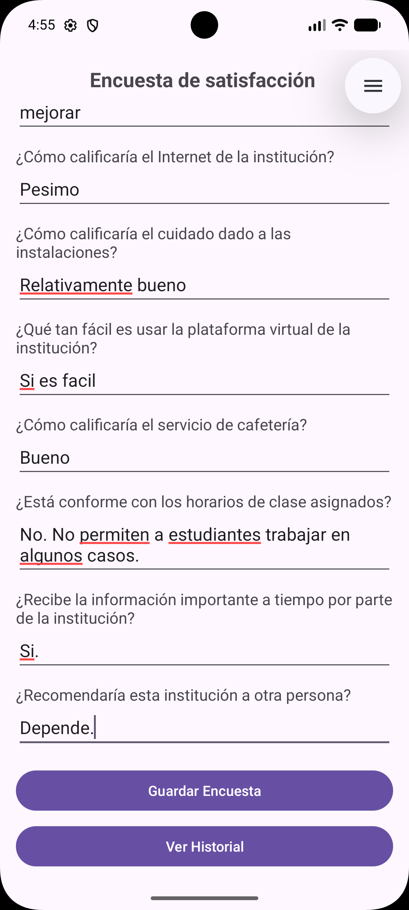
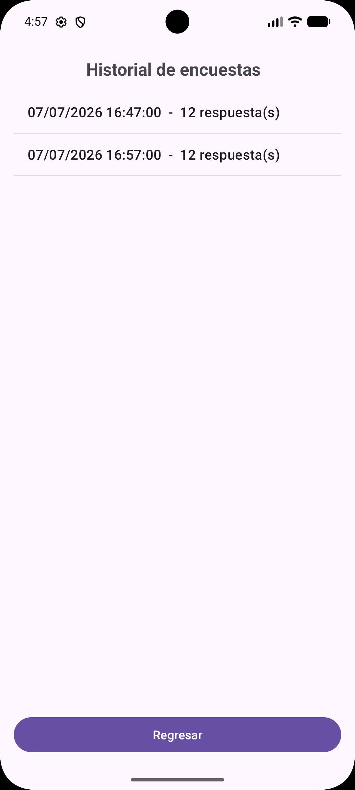
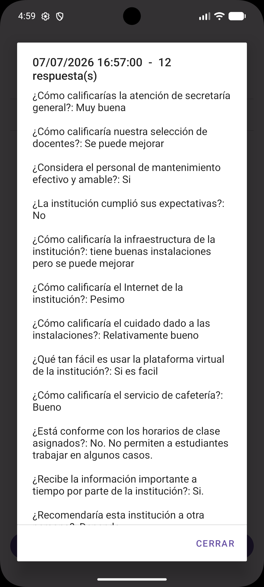

# App de Encuestas Offline

Taller de Android Studio (Programación Móvil / Lenguajes de Programación). Consiste en una app que permite hacer una encuesta de satisfacción a una institución educativa, guardando todo en una base de datos local (SQLite) para que funcione sin necesidad de internet.

La particularidad del ejercicio es que las preguntas **no están quemadas en el XML**: se guardan en la base de datos y la pantalla de encuesta se arma dinámicamente por código a partir de lo que hay en la tabla `preguntas`.

## Qué hace la app

1. La primera vez que corre, se crea la base `Encuestas.db` con 12 preguntas ya insertadas (relacionadas con distintos aspectos de la institución: secretaría, docentes, mantenimiento, infraestructura, internet, instalaciones, plataforma virtual, cafetería, horarios, comunicación y recomendación general).
2. En la pantalla principal se leen esas preguntas y se genera un `TextView` + `EditText` por cada una.
3. Al presionar **Guardar Encuesta**, se inserta una respuesta por pregunta en la tabla `respuestas`, todas con la misma fecha/hora (así se sabe que pertenecen a la misma encuesta).
4. En **Ver Historial** se listan todas las encuestas guardadas, mostrando fecha/hora y cantidad de respuestas. Al tocar una, se abre un diálogo con el detalle completo (cada pregunta con su respuesta).

## Capturas

<p float="left">
  
  
  
</p>

De izquierda a derecha: llenando la encuesta, historial general, detalle de una encuesta.

## Estructura del proyecto

```
app/src/main/java/com/example/myapplication3/
├── SurveyContract.java   -> nombres de tablas y columnas de la BD
├── SurveyDbHelper.java   -> crea la BD e inserta las preguntas fijas (onCreate)
├── MainActivity.java     -> pantalla de encuesta, arma el formulario dinámico y guarda respuestas
└── Listado.java          -> pantalla de historial, agrupa respuestas por encuesta

app/src/main/res/layout/
├── activity_main.xml     -> contenedor vacío donde se inyectan las preguntas + botones
└── activity_listado.xml  -> ListView del historial + botón Regresar
```

### SurveyContract
Define los nombres de las dos tablas (`preguntas` y `respuestas`) y sus columnas, además de las sentencias SQL para crearlas/borrarlas. No tiene lógica, solo constantes.

### SurveyDbHelper
Extiende `SQLiteOpenHelper`. En `onCreate` crea las tablas y hace los `INSERT` de las 12 preguntas — el usuario nunca las escribe, quedan ahí desde el primer arranque. `onUpgrade`/`onDowngrade` borran y recrean todo si sube la versión de la base.

### MainActivity
Al iniciar, consulta la tabla `preguntas` y por cada fila crea los componentes de vista y los agrega a un `LinearLayout` dentro de un `ScrollView`. Guarda una lista de los `EditText` generados y sus IDs de pregunta para poder leerlos después. El botón "Guardar Encuesta" genera una fecha una sola vez y hace un `INSERT` por cada respuesta usando esa misma fecha, para que en el historial se puedan agrupar como una sola encuesta.

### Listado
Trae todas las filas de `respuestas` ordenadas por fecha y las va agrupando: cada vez que cambia la fecha, cierra el resumen anterior y empieza uno nuevo. Se usa un `ListView` con `ArrayAdapter` normal (sin RecyclerView ni adapters personalizados) donde cada item muestra fecha + cantidad de respuestas. Al tocar un item se abre un `AlertDialog` con el detalle completo, unión hecha con una consulta chica a `preguntas` por cada respuesta.

## Decisiones de diseño

- **ListView en vez de RecyclerView**: para este nivel es más simple y no necesita ViewHolder ni adapters personalizados.
- **Fecha generada en Java, no `CURRENT_TIMESTAMP` de SQLite**: se necesita que todas las respuestas de una misma encuesta compartan exactamente la misma fecha para poder agruparlas al armar el historial.
- **Resumen corto + detalle en diálogo**: mostrar las 12 respuestas completas de una vez en la lista hacía que un solo item ocupara toda la pantalla. Por eso la lista solo muestra fecha y cantidad de respuestas, y el detalle completo aparece al tocar el item.
- **Sin librerías externas**: todo con Java, SQLite y componentes básicos de Android (`View`, `ListView`, `ScrollView`, `AlertDialog`, `Cursor`, `ContentValues`).


## Cómo correrlo

1. Abrir el proyecto en Android Studio.
2. Ejecutar en un emulador o dispositivo (mínimo SDK 24).
3. La base se crea sola en el primer arranque, con las 12 preguntas ya cargadas.
